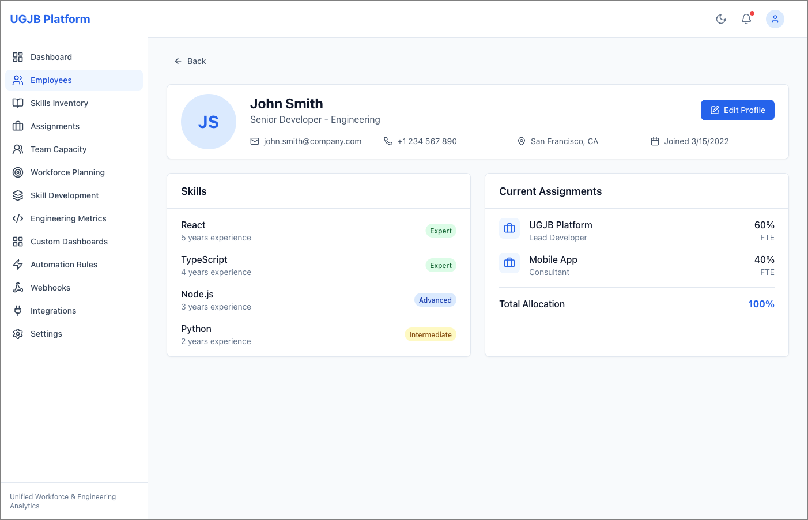

# UGJB Platform

**Unified Workforce & Engineering Analytics**

> Bridge the gap between talent decisions and technical outcomes.


---

## The Problem

Engineering organizations today operate with **fragmented systems**:

- **HR platforms** (BambooHR, Lattice) track employee skills and FTE allocation but lack engineering metrics
- **Engineering tools** (Swarmia, LinearB) monitor DORA metrics and code quality but ignore workforce planning
- **The result**: CTOs can't answer "Does Kubernetes expertise reduce incident resolution time?" without manual spreadsheets

This fragmentation costs enterprises **$200k+ in 3-year TCO** through licensing fees, **160-460 hours** of custom integration development, and countless hours of context-switching between disconnected dashboards.

## The Solution

UGJB is an **open-source modular platform** that unifies:

| Domain | Capabilities |
|--------|--------------|
| **HR Management** | Employee profiles, skills tracking, FTE allocation |
| **Engineering Analytics** | DORA metrics, code quality, deployment tracking |
| **Workforce Planning** | Team capacity, project assignments, resource optimization |
| **Integrations** | Jira, GitLab, GitHub, Prometheus, Firebase Crashlytics |

### Skills + Assignments in One View



See an employee's skills (with proficiency levels), current project assignments, and total FTE allocation at a glance. The platform enforces FTE limits (max 100%) automatically.

### Real-Time Team Capacity


Instantly identify overloaded and under-utilized teams. Make data-driven staffing decisions based on actual allocation data.

---

## Key Features

### Core Workflows

- **Employee Management**: Create/update profiles, track skills with proficiency levels (Beginner/Intermediate/Expert)
- **FTE Allocation**: Assign employees to projects with automatic validation (total cannot exceed 100%)
- **Skills Inventory**: Curated taxonomy with admin approval for new skills
- **DORA Metrics**: Deployment frequency, lead time, change failure rate, MTTR
- **Custom Dashboards**: Build KPI dashboards with bar charts, line charts, gauges, heatmaps
- **Automation Rules**: No-code rules for performance-based workflows

### Integrations

| Source | Data Synced |
|--------|-------------|
| Jira | Issues, tasks, sprint data |
| GitLab/GitHub | Commits, PRs, code reviews |
| Firebase Crashlytics | Incident frequency, error rates |
| Prometheus | System uptime, alert volume |

### Role-Based Access

| Role | Access |
|------|--------|
| HR Manager | Full employee/workforce data |
| Engineering Lead | Team-level metrics + direct reports |
| Individual Contributor | Own data only |

---

## Quick Start

### Prerequisites

- Docker & Docker Compose
- Node.js 18+ (for web UI development)
- Go 1.21+ (for API gateway)

### Run All Services

```bash
# Clone the repository
git clone <repository-url>
cd UGJB

# Start all services
docker compose up -d

# Verify services are running
curl http://localhost:8080/health   # API Gateway
curl http://localhost:8010/         # Web UI
```

### Service Endpoints

| Service | Port | Description |
|---------|------|-------------|
| Web UI | 8010 | React frontend |
| API Gateway | 8080 | Unified entry point (Go/Gin) |
| Nginx Proxy | 8081 | Development reverse proxy |

### Development Mode

```bash
# Start backend services
docker compose up -d

# Start web UI in development mode
cd web/app
npm install
npm run dev  # Runs on localhost:3000
```

---

## Architecture

### Bounded Contexts

| Context | Responsibility | Technology |
|---------|---------------|------------|
| HR-Management | Employee lifecycle, skills, allocation | Java 17, Spring Boot |
| Engineering-Analytics | DORA metrics, code quality, dashboards | Python 3.11, FastAPI |
| Goal-Management | OKRs, objectives, key results | TypeScript, NestJS |
| Project-Management | Sprints, tasks, resource coordination | TypeScript, NestJS |
| Workforce-Wellbeing | Burnout prediction, team health | Python 3.11, scikit-learn |
| System-Integration | ETL pipelines, API gateway | Go, Kotlin, Apache Camel |

### Data Flow

```
External Tools (Jira, GitLab, Prometheus)
         ↓
    Integration Service (normalize)
         ↓
    Analytics Aggregator (correlate)
         ↓
    Domain Services (HR, Engineering, Goals)
         ↓
    API Gateway → Web UI
```

---

## API Overview

Base URL: `/api/v1`

| Resource | Endpoints |
|----------|-----------|
| Employees | `GET/POST /employees`, `GET/PUT /employees/{id}` |
| Skills | `GET/POST /skills`, `POST /employees/{id}/skills` |
| Assignments | `GET/POST /assignments`, `PUT /assignments/{id}` |
| Engineering Activity | `GET /employees/{id}/activity` |
| Integrations | `GET/POST/PUT /integrations` |

Authentication: Bearer Token (JWT)
Rate Limit: 1000 requests/hour/user

---

## Success Metrics

| Metric | Target |
|--------|--------|
| 3-Year TCO | ≤ $120k (vs $200k+ commercial) |
| Integration Coverage | 100% (Jira, GitLab, Firebase, Prometheus) |
| Time-to-Insight | ≤ 2 hours (data → KPI) |
| Platform Uptime | ≥ 99.9% |

---

## Contributing

1. Follow the service structure defined in `services.json`
2. Add Gherkin scenarios for new features
3. Run tests before submitting PRs

---

## License

[License details to be added]
