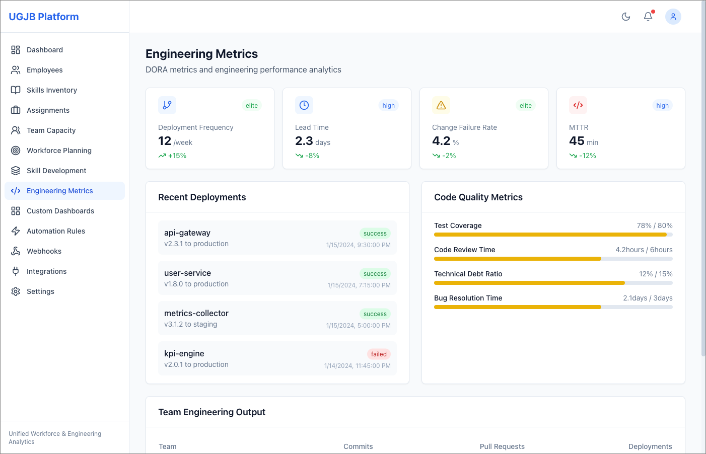
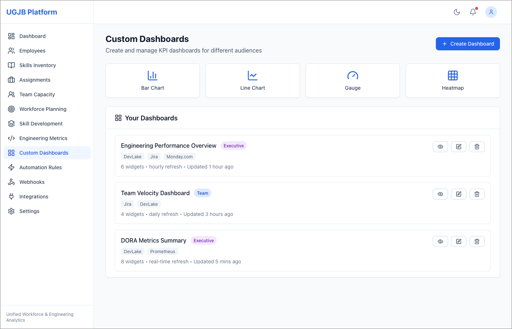

# UGJB Platform

[](https://github.com/qtvhao/UGJB)
[](LICENSE)

> **Unified Workforce & Engineering Analytics** — Bridging the gap between HR management and engineering performance in a single open-source platform.

---

## The Problem: A Divided House

Picture this: Your engineering manager celebrates a 99.9% uptime quarter, but your HR team just discovered that three senior developers with Kubernetes expertise are overallocated at 130% FTE. Meanwhile, your CTO can't answer a simple question: *"Does our investment in training React developers correlate with faster feature delivery?"*

This isn't a failure of leadership—it's a failure of **tooling**.

Tech companies today operate with a critical divide:

- **HR platforms** (BambooHR, Lattice, Rippling) excel at employee lifecycle management but are blind to engineering outcomes—they can't tell you if skills impact DORA metrics
- **Engineering tools** (Swarmia, LinearB, DevLake) provide deep code analytics but ignore workforce fundamentals—no FTE tracking, skills inventory, or capacity planning
- **Enterprise SaaS** solutions promise unification but deliver vendor lock-in, per-user pricing that scales painfully ($200k+ over 3 years), and black-box extensibility

The result? **Critical gaps that cost real money:**
- Firebase Crashlytics and Prometheus integrations require 40–80 hours of custom API development *per system*
- HR teams allocate people to projects without visibility into current workload or technical skills
- Engineering leaders lack unified dashboards correlating team composition with delivery velocity
- Finance struggles to justify headcount decisions without data linking skills to business outcomes

---

## The UGJB Solution: One Platform, Complete Visibility

UGJB (Unified Workforce & Engineering Analytics Platform) eliminates this divide by combining **HR management** with **deep engineering analytics** in a single, open-source system.

### What Makes UGJB Different

**For HR Leaders:** See the full picture
Manage employees, skills, and capacity *alongside* engineering performance. Answer questions like:
- Which teams are overallocated relative to their sprint velocity?
- Does Kubernetes certification reduce incident resolution time?
- Where are our skill gaps slowing down roadmap delivery?

**For Engineering Managers:** Understand your team's capacity
View DORA metrics, code activity, and system reliability *integrated with* workforce data. Know:
- Is my team's 30% turnover impacting our change failure rate?
- Which skills correlate with faster PR review cycles?
- Are we allocating senior engineers to projects that need them most?

**For Finance & Operations:** Predictable costs, measurable ROI
Eliminate per-user SaaS fees with open-source modularity. Track:
- 3-year TCO: **≤$120k** (vs. $200k+ for SaaS alternatives)
- Skills-to-outcome correlation (e.g., "20% faster lead time for teams with full-stack expertise")
- Integration costs reduced by **50%** through standardized connectors

---

## See It In Action


**Employee Directory** — Complete profiles with skills, FTE allocation, department, and real-time status tracking. Role-based access ensures HR, engineering leads, and individuals see exactly what they need.


**DORA Metrics & Performance Analytics** — Track deployment frequency, change failure rate, MTTR, and lead time. Integrated code activity shows commits, PRs, and issue completion rates—all correlated with team composition.


**Configurable KPI Dashboards** — Create tailored views for executives (strategic OKRs), team leads (sprint velocity + capacity), or platform teams (system health + on-call rotation). Real-time refresh with historical trending.

---

## Quick Start

### Prerequisites

- Docker & Docker Compose
- Git

### Installation

```bash
# Clone the repository
git clone https://github.com/qtvhao/UGJB.git
cd UGJB

# Start all services
docker-compose up -d

# Verify health checks
curl http://localhost:8080/health  # API Gateway
curl http://localhost:8081         # Web UI (via nginx proxy)
```

### Access the Platform

- **Web UI**: http://localhost:8081
- **API Gateway**: http://localhost:8080
- **API Documentation**: http://localhost:8080/docs

### Basic Usage

**1. Create an Employee Profile**

```bash
curl -X POST http://localhost:8080/api/v1/employees \
  -H "Content-Type: application/json" \
  -d '{
    "name": "Jane Smith",
    "role": "Senior Backend Engineer",
    "department": "Engineering",
    "status": "active",
    "fte": 100,
    "skills": [
      {"name": "Kubernetes", "proficiency": "Expert"},
      {"name": "Python", "proficiency": "Expert"},
      {"name": "PostgreSQL", "proficiency": "Intermediate"}
    ]
  }'
```

**2. Configure GitLab Integration**

Navigate to **Settings → Integrations** in the Web UI:
- Select **GitLab**
- Enter your API endpoint and personal access token
- Set sync frequency (minimum daily, real-time webhooks recommended)
- Test connection and enable

**3. View Unified Analytics**

- **Engineering Metrics page**: DORA metrics (deployment frequency, lead time, change failure rate, MTTR)
- **Team Capacity page**: Real-time FTE allocation, project assignments, skill distribution
- **Custom Dashboards**: Create KPI views combining HR data (skills, tenure) with engineering outcomes (velocity, quality)

---

## Why Choose UGJB?

### ✅ Unified Insights Across Domains

Stop context-switching between HR, project management, and engineering tools. UGJB answers cross-functional questions in seconds:

- *"Does our React training investment correlate with faster feature delivery?"*
  → Skills inventory + Jira sprint metrics + GitLab commit analysis
- *"Which teams are at burnout risk based on allocation and incident volume?"*
  → FTE tracking + Prometheus alerts + on-call rotation data
- *"Can we reallocate capacity from Platform to Product without impacting SLOs?"*
  → Team skills matrix + DORA reliability metrics + project roadmaps

### 💰 Cost Optimization: Open Source, Zero Lock-In

| Approach | 3-Year TCO | Extensibility | Data Ownership |
|----------|-----------|---------------|----------------|
| **UGJB (Open Source)** | **≤$120k** | Full control, custom integrations | You own everything |
| SaaS (Lattice + LinearB) | $200k–$300k | Vendor APIs only | Platform-dependent exports |
| Custom Build | $150k–$250k | Unlimited (high maintenance) | Complete |

**No per-user fees.** Scale from 50 to 5,000 employees without license shocks.
**Standardized integrations.** Pre-built connectors for GitLab, Jira, Firebase, Prometheus reduce custom dev time by 50%.

### 🔒 Enterprise-Grade Reliability

- **99.9% uptime SLA** with health checks across all microservices
- **Comprehensive observability**: Prometheus metrics, distributed tracing (OpenTelemetry), centralized logging (ELK)
- **Real-time sync**: Cross-domain event propagation via Kafka (e.g., "Employee skills updated" → project reallocation triggers)
- **Security-first**: OAuth2/OIDC authentication, role-based access control, network policies per bounded context

### 🛠️ Customization Without Chaos

- **Modular microservices**: 13 services across 6 bounded contexts—deploy what you need
- **Extensible integration patterns**: Add new tools (e.g., Monday.com, DevLake) via standardized adapters
- **No-code automation**: Configure workflows (e.g., "Alert HR when Prometheus detects team overload") without touching code
- **API-first design**: OpenAPI 3.x specs for REST, AsyncAPI for events, gRPC for high-performance service communication

---

## Technical Architecture

UGJB uses a **microservices architecture** with 6 bounded contexts, each owning its data and exposing well-defined APIs:

### Bounded Contexts

| Context | Microservices | Technology Stack | Responsibility |
|---------|---------------|------------------|----------------|
| **HR Management** | EmployeeRegistry, AllocationEngine | Java 17, Spring Boot, Hibernate | Employee profiles, skills, capacity planning |
| **Engineering Analytics** | MetricsCollector, KPIEngine, InsightsDashboard | Python 3.11, FastAPI, PySpark, React | DORA metrics, code quality, crash analytics |
| **Goal Management** | ObjectiveService, KeyResultTracker | TypeScript, NestJS, TypeORM | OKRs, key results, performance reviews |
| **Project Management** | SprintCoordinator, TaskDispatcher | TypeScript, NestJS, BullMQ | Sprint planning, task allocation, roadmaps |
| **System Integration** | DataPipeline, API Gateway | Kotlin, Apache Camel, Go/Gin | ETL for Jira/GitLab/Firebase, unified API entry |
| **Workforce Wellbeing** | WellbeingMonitor, BurnoutPredictor | Python 3.11, FastAPI, XGBoost | Burnout risk ML models, team health surveys |

### Data Stores

- **Transactional**: PostgreSQL (ACID-compliant for HR, projects, goals)
- **Time-Series**: InfluxDB (engineering metrics), TimescaleDB (wellbeing indicators)
- **Analytical**: ClickHouse (DORA metrics aggregation)
- **Cache**: Redis (dashboard query optimization)
- **Messaging**: Kafka (cross-context events), RabbitMQ (domain events)

### Observability Stack

- **Metrics**: Prometheus + Grafana dashboards
- **Logging**: ELK (Elasticsearch, Logstash, Kibana)
- **Tracing**: OpenTelemetry with Jaeger

---

## Integrations

UGJB provides **out-of-the-box connectors** for common tools:

| Tool | Purpose | Data Synchronized | Protocol |
|------|---------|-------------------|----------|
| **GitLab** | Version control | Commits, merge requests, code reviews | REST + Webhooks |
| **Jira** | Issue tracking | Issues, sprints, cycle time | REST + Webhooks |
| **Firebase Crashlytics** | Incident monitoring | Crashes, error attribution | Push notifications |
| **Prometheus** | System metrics | Alerts, uptime, resource usage | Query API (PromQL) |
| **DevLake** | Engineering data lake | DORA metrics aggregation | REST |
| **Monday.com** | Project management | Tasks, workflows, timelines | GraphQL |
| **Lattice** | Performance management | OKRs, reviews, 1:1 notes | REST |

**Adding new integrations?** Follow the standardized adapter pattern in `services/system-integration/microservices/data-pipeline`.

---

## Success Metrics: What You Can Achieve

Based on our product vision and validated use cases:

| Metric | Baseline (Fragmented Tools) | UGJB Target | Impact |
|--------|------------------------------|-------------|--------|
| **3-Year TCO** | $201k–$246k | ≤$120k | **~$100k saved** |
| **Integration Coverage** | 50% GitLab, 0% Firebase/Prometheus | 100% across all tools | **Complete visibility** |
| **Time-to-Insight** | 72+ hours (manual data stitching) | ≤2 hours (real-time dashboards) | **36x faster decisions** |
| **Custom Integration Effort** | 250–460 hours per system | ≤200 hours (standardized adapters) | **50% dev time reduction** |
| **Skills-Outcome Correlation** | Unmeasured | 20% faster lead time for skilled teams | **Data-driven hiring/training** |

---

## Internationalization

UGJB documentation is available in **17 languages**:

🇨🇳 [简体中文](./i18n/README_zh-hans.md) | 🇹🇼 [繁體中文](./i18n/README_zh-hant.md) | 🇰🇷 [한국어](./i18n/README_ko.md) | 🇪🇸 [Español](./i18n/README_es.md) | 🇯🇵 [日本語](./i18n/README_ja.md) | 🇮🇳 [हिन्दी](./i18n/README_hi.md) | 🇷🇺 [Русский](./i18n/README_ru.md) | 🇧🇷 [Português](./i18n/README_pt-br.md) | 🇮🇳 [తెలుగు](./i18n/README_te.md) | 🇫🇷 [Français](./i18n/README_fr.md) | 🇩🇪 [Deutsch](./i18n/README_de.md) | 🇮🇹 [Italiano](./i18n/README_it.md) | 🇻🇳 [Tiếng Việt](./i18n/README_vi.md) | 🇵🇰 [اردو](./i18n/README_ur.md) | 🇸🇦 [العربية](./i18n/README_ar.md) | 🇧🇩 [বাংলা](./i18n/README_bn.md)

---

## License

MIT License — see the [LICENSE](LICENSE) file for details.

You are free to use, modify, and distribute UGJB for personal or commercial purposes. Contributions are governed by our [Contributing Guidelines](CONTRIBUTING.md).

---

## Support & Community

### Get Help

- 📖 **Documentation**: Comprehensive guides in `docs/` covering architecture, deployment, and implementation
- 🐛 **Issues**: Report bugs or request features at [GitHub Issues](https://github.com/qtvhao/UGJB/issues)
- 💬 **Discussions**: Join the community at [GitHub Discussions](https://github.com/qtvhao/UGJB/discussions)

### Contributing

We welcome contributions! Whether it's:
- 🔧 Bug fixes or feature implementations
- 📝 Documentation improvements or translations
- 🧪 Test coverage enhancements
- 💡 Integration adapters for new tools

Please read our [Contributing Guide](CONTRIBUTING.md) to get started.

---

## What's Next?

### For Implementers

1. **Phase 0: Foundation** — Set up local dev environment, CI/CD, observability (see `agent/plans/ZERO-TO-ONE-PLAN/Phases/Phase-0-Foundation/`)
2. **Phase 1: Core MVP** — Implement employee management, engineering metrics, basic dashboards (see `agent/plans/ZERO-TO-ONE-PLAN/Phases/Phase-1-Core-MVP/`)
3. **Production Deployment** — Scale to production with Kubernetes, configure integrations, enable advanced analytics

### For Decision-Makers

- **ROI Calculator**: Use `docs/strategy/product-vision.md` to model your 3-year TCO vs. SaaS alternatives
- **Pilot Program**: Start with HR Management + Engineering Analytics contexts (2–4 weeks to value)
- **Vendor Comparison**: See `docs/modeling_design/domain-model/Context-Summary.md` for UGJB vs. Monday.com + DevLake vs. Lattice + LinearB

---

## The Vision

Imagine a world where:

- HR allocates developers to projects based on **real-time skills-performance correlations**, not gut feel
- Engineering managers view **unified dashboards** of sprint velocity, crash rates, and team capacity—no context-switching
- Finance tracks **predictable costs** with zero per-user fees, justifying headcount with data linking skills to revenue impact
- Product teams **close the feedback loop** between hiring, training, allocation, and delivery metrics

**This is the UGJB vision: Bridge the HR-Engineering Divide. Own your data. Scale without limits.**

---

<div align="center">

### Start Bridging the Gap Today 🚀

[](#quick-start)
[](#technical-architecture)
[](https://github.com/qtvhao/UGJB/discussions)

*Built with ❤️ by the UGJB community*

</div>
